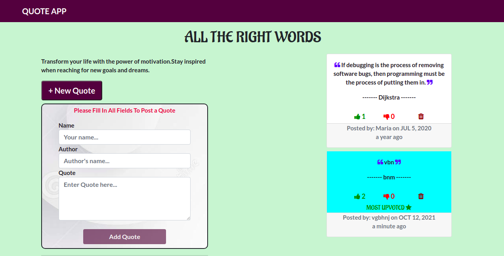

# Quote App
#### By Mary Njenga
### Site image

## Table of Content
+ [Description](#description)
+ [Behaviour Driven Development](#Behaviour-Driven-Development)
+ [Installation Requirement](#Installation)
+ [Technology Used](#technology-used)
+ [Licence](#licence)
+ [Authors Info](#authors-info)
## Description
 This is a quotes application that enables users to post their own quotes, view quotes and vote for their favorite quote. The most upvoted quote is highlighted.
****
## Behaviour Driven Development
| Behaviour      | Input     | Output     |
| :------------- | :----------: | -----------: |
|  Empty form    | User submits empty form | An error is message is displayed    |
|  Valid input    | User enters a valid details and submits    | The quote is added to the quote list  |
|  Upvotes    | User upvotes a quote   | The quote with highest upvotes is highlighted  |

****
## Installation
### Requirements
* [Angular CLI](https://github.com/angular/angular-cli) version 12.2.7.
* Access to the Internet
### Installation Process
* Run npm i to import the modules used.
* Run `ng serve` for a dev server. Navigate to `http://localhost:4200/`. The app will automatically reload if you change any of the source files.

### Development server

Run `ng serve` for a dev server. Navigate to `http://localhost:4200/`. The app will automatically reload if you change any of the source files.
### Code scaffolding

Run `ng generate component component-name` to generate a new component. You can also use `ng generate directive|pipe|service|class|guard|interface|enum|module`.

### Build

Run `ng build` to build the project. The build artifacts will be stored in the `dist/` directory.

****

### Live link
 Click on the link to view the site.https://mary-wan.github.io/QuoteApp/
****
[Go Back to the top](#quote-app)
## Technology Used
* Typescript
* HTML 
* CSS 
* Javascript 

****
[Go Back to the top](#quote-app)
## Licence
MIT License

Copyright (c) 2021 Mary Njenga

Permission is hereby granted, free of charge, to any person obtaining a copy
of this software and associated documentation files (the "Software"), to deal
in the Software without restriction, including without limitation the rights
to use, copy, modify, merge, publish, distribute, sublicense, and/or sell
copies of the Software, and to permit persons to whom the Software is
furnished to do so, subject to the following conditions:

The above copyright notice and this permission notice shall be included in all
copies or substantial portions of the Software.

THE SOFTWARE IS PROVIDED "AS IS", WITHOUT WARRANTY OF ANY KIND, EXPRESS OR
IMPLIED, INCLUDING BUT NOT LIMITED TO THE WARRANTIES OF MERCHANTABILITY,
FITNESS FOR A PARTICULAR PURPOSE AND NONINFRINGEMENT. IN NO EVENT SHALL THE
AUTHORS OR COPYRIGHT HOLDERS BE LIABLE FOR ANY CLAIM, DAMAGES OR OTHER
LIABILITY, WHETHER IN AN ACTION OF CONTRACT, TORT OR OTHERWISE, ARISING FROM,
OUT OF OR IN CONNECTION WITH THE SOFTWARE OR THE USE OR OTHER DEALINGS IN THE
SOFTWARE.

****
[Go Back to the top](#quote-app)
## Authors Info
* Slack Profile - [Mary Njenga](https://app.slack.com/client/T077KKCG6/GLRQR61NW/user_profile/U027VKL1WLT?cdn_fallback=1)
* Email - [Mary Njenga](mary.njenga@student.moringaschool.com)

[Go Back to the top](#quote-app)
